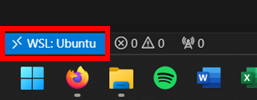
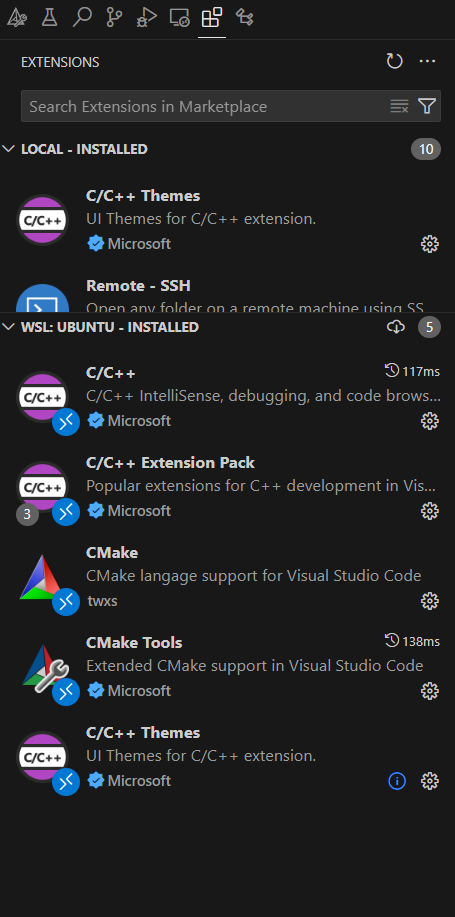
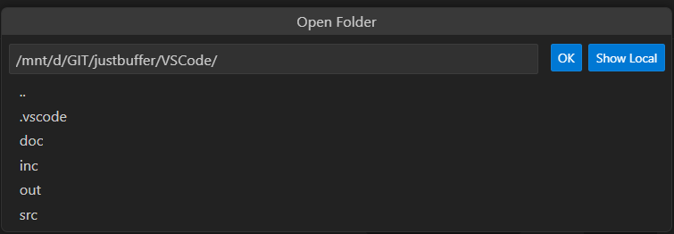
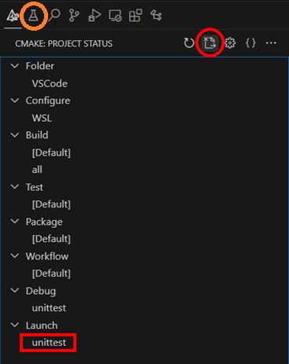

# JustBuffer
Een repo om de spiQueue code te testen met tools zoals:
  - gtest
  - valgrind
  - cppcheck

# Setup WSL
[Officiële WSL installatie handleiding](https://learn.microsoft.com/en-us/windows/wsl/install)\
Houdt er rekening mee dat WSL hyper-v gebruikt. De CPU moet dus Hyper-V geschikt zijn en de optie moet ingeschakeld zijn in de BIOS. Hyper-V is wat Intel gepopulariseerd heeft. Het AMD equivalent heet AMD-V.

Open een powershell terminal en input:
```console
PS:> wsl --install
```
Dit zal automatisch een Ubuntu subsysteem instaleren als deze niet bestond. De installatie zal voor de volgende gebruiker input vragen:
- voor de gebruiker naam: wsl
- voor het wachtwoord: wsl
- wachtwoord confirmatie: wsl

Begin met het updaten van de Ubuntu sub systeem, input:
```console
wsl:~$ sudo apt update
wsl:~$ sudo apt upgrade
```

Instaleer nu de benodigde missende binaries voor dit project, input:
```console
wsl:~$ sudo apt install cmake g++ gdb doxygen graphviz mscgen cppcheck
```
In geval dat je WSL terminal kwijt bent kan je de Ubuntu programma lanceren dat zich nu in je Windows start menu bevindt.
 
# Setup VSCode
In VSCode gebruik de remote connection om in de WSL omgeving te komen. WSL support is mogelijk dankzij een standaard geïnstalleerde WSL extensie in VSCode.

<p align="center">
  
</p>

Navigeer nu naar de extensions store. Er zullen twee secties verschijnen, local en remote. Instaleer "Cmake tools" en "C/C++ Extension Pack" in remote. 

<p align="center">
  
</p>

Open daarna folder en navigeer naar de vscode project map. Dit doe je door eerst naar /mnt te navigeer. Je Windows schijven zullen hier als drive letters verschijnen. Vanaf waar je naar VSCode map in de git repository kan navigeren.

<p align="center">
  
</p>

# Run test
In de Cmake tools tab run de "delete cache and reconfigure" optie
opgevolgd door run de "launch" optie.

<p align="center">
  
</p>

# De funnies
VSCode is geen IDE. VSCode, Cmake, valgrind, cppcheck is allemaal op elkaar gebout. Dit lijdt tot lompe workflow af en toe. Elke Gtest hoort op zichzelf staande te zijn, in andere woorden case A hoort geen invloed te hebben op case B.

Een Gtest kan individueel aangeroepen worden door de gecompileerde binary een gtest filter argument mee te geven. Dit is wat Ctest doet, de test tool van Cmake waar Gtest zich aan bindt. Deze is direct aan te roepen in het test tabblad aangegeven met de oranje cirkel.

Als de launch of debug optie gebruikt wordt dan runt het alle tests in een keer en zullen de globale waarden ook overdragen van case naar case. Om dit tegen te houden wordt er een gtest fixture gebruikt. Deze is afhankelijk van een class. In de class zit een constructor dat de globale waardes continue reset.

Cppcheck wordt in een wijze automatisch uitgevoerd maar bevindt zich in de output terminal en niet de user terminal sectie.

Doxygen was veel vervelender dan dat ik verwacht had en lijkt wel een project op zichzelf. Om een doxy te generen moet je build target van all omzetten naar doxygen.